# Codex CLI 源代码深度解析

> 一份让你真正理解 Codex、会用 Codex、懂 AI CLI 设计的完整指南

---

## 目录

1. [概述与快速入门](#1-概述与快速入门)
2. [整体架构设计](#2-整体架构设计)
3. [核心模块详解](#3-核心模块详解)
4. [技术原理深度分析](#4-技术原理深度分析)
5. [数据流与时序图](#5-数据流与时序图)
6. [AI CLI 通用设计模式](#6-ai-cli-通用设计模式)
7. [实战使用指南](#7-实战使用指南)
8. [扩展开发指南](#8-扩展开发指南)

---

## 1. 概述与快速入门

### 1.1 什么是 Codex

Codex 是 OpenAI 开发的 AI 编程助手 CLI 工具，它能够：
- 理解自然语言指令
- 执行代码修改
- 运行 Shell 命令
- 集成外部工具（MCP）
- 支持多会话管理

### 1.2 核心特性

| 特性 | 描述 |
| --- | --- |
| **多模型支持** | OpenAI、Ollama、LM Studio |
| **沙盒安全** | Linux Landlock、macOS Seatbelt、Windows Sandbox |
| **MCP 协议** | Model Context Protocol 工具集成 |
| **技能系统** | 可扩展的技能注入机制 |
| **会话持久化** | 会话恢复和分支 |

### 1.3 技术栈

```
┌─────────────────────────────────────────────────────────────┐
│                      技术栈总览                              │
├─────────────────────────────────────────────────────────────┤
│  前端/CLI    │  TypeScript (Node.js) + Rust (ratatui)        │
│  核心引擎    │  Rust (Tokio 异步运行时)                       │
│  AI 接口     │  OpenAI API / 兼容 API                        │
│  沙盒技术    │  Landlock / Seatbelt / Windows Sandbox        │
│  协议        │  JSON-RPC / MCP / WebSocket                   │
│  存储        │  SQLite (状态) / JSONL (会话)                 │
└─────────────────────────────────────────────────────────────┘
```

---

## 2. 整体架构设计

### 2.1 系统分层架构

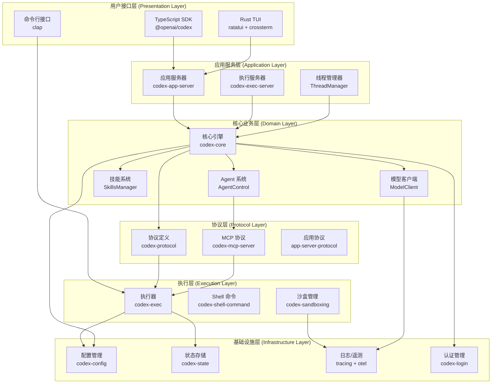

### 2.2 模块职责划分

| 层级 | 模块 | 职责 |
| --- | --- | --- |
| **用户接口** | TypeScript SDK | 提供 JS/TS 开发者 API |
| | TUI | 终端交互界面 |
| | CLI | 命令行参数解析 |
| **应用服务** | App Server | 进程间通信、会话协调 |
| | Exec Server | 命令执行管理 |
| | Thread Manager | 多会话生命周期管理 |
| **核心业务** | Codex Core | AI 对话、上下文管理 |
| | Agent System | 多 Agent 协作 |
| | Skills | 技能加载和注入 |
| | Model Client | AI 模型调用 |
| **协议** | Protocol | 内部消息定义 |
| | MCP | 外部工具集成 |
| **执行** | Executor | 命令执行 |
| | Sandbox | 安全隔离 |
| **基础设施** | Config | 配置加载 |
| | State | 状态持久化 |

### 2.3 87 个 Rust Crates 分类

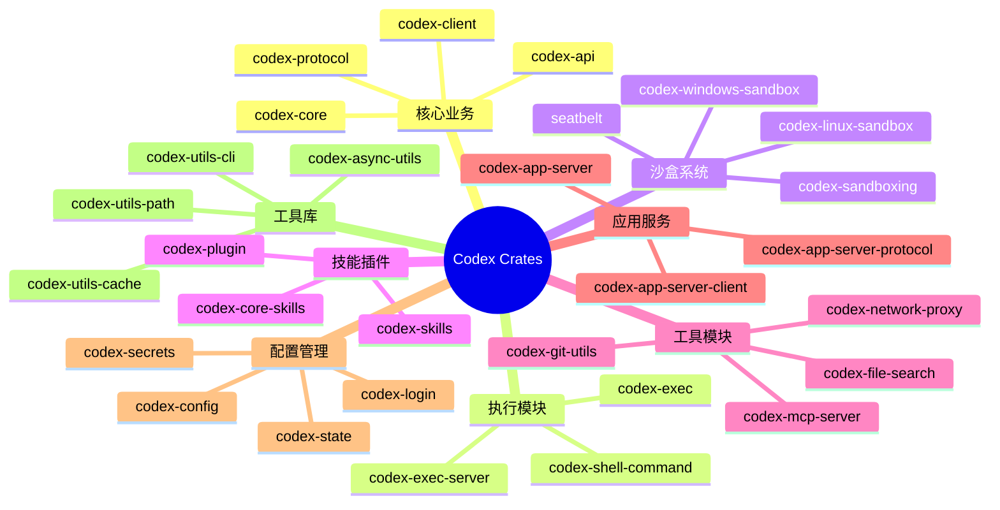

---

## 3. 核心模块详解

### 3.1 会话管理机制

#### 3.1.1 ThreadManager 架构

ThreadManager 是整个系统的会话协调中心：

```rust
// 位置: codex-rs/core/src/thread_manager.rs

pub struct ThreadManager {
    state: Arc<Mutex<ThreadManagerInner>>,
}

struct ThreadManagerInner {
    // 活跃连接
    live_connections: HashSet<ConnectionId>,
    // 会话实例
    threads: HashMap<ThreadId, ThreadEntry>,
    // 连接-会话映射
    thread_ids_by_connection: HashMap<ConnectionId, HashSet<ThreadId>>,
}

struct ThreadEntry {
    thread: Arc<CodexThread>,
    subscribers: HashSet<ConnectionId>,
    metadata: ThreadMetadata,
}
```

**设计模式**: 生产者-消费者模式 + 观察者模式

#### 3.1.2 CodexThread 生命周期

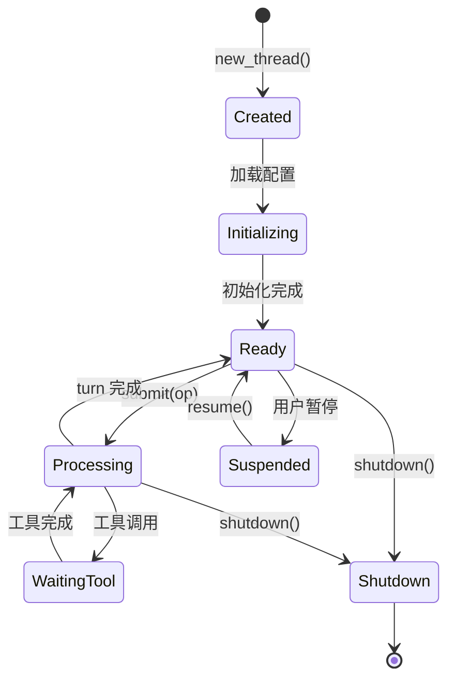

**核心实现**:

```rust
// 位置: codex-rs/core/src/codex_thread.rs

pub struct CodexThread {
    // 核心代理实例
    pub(crate) codex: Codex,
    // 会话持久化路径
    rollout_path: Option<PathBuf>,
    // 异步请求计数
    out_of_band_elicitation_count: Mutex<u64>,
    // 文件监控注册
    _watch_registration: WatchRegistration,
}

impl CodexThread {
    // 提交用户操作
    pub async fn submit(&self, op: Op) -> CodexResult<String> {
        self.codex.submit(op).await
    }

    // 流式输入引导
    pub async fn steer_input(
        &self,
        input: Vec<UserInput>,
        expected_turn_id: Option<&str>,
    ) -> Result<String, SteerInputError> {
        self.codex.steer_input(input, expected_turn_id).await
    }

    // 优雅关闭
    pub async fn shutdown_and_wait(&self) -> CodexResult<()> {
        self.codex.shutdown_and_wait().await
    }
}
```

#### 3.1.3 会话持久化机制

```rust
// 位置: codex-rs/core/src/rollout.rs

pub struct RolloutRecorder {
    path: PathBuf,
    events: Vec<EventMsg>,
    flush_policy: FlushPolicy,
}

// 会话元数据
pub struct SessionMeta {
    pub id: ThreadId,
    pub name: String,
    pub created_at: SystemTime,
    pub last_active_at: SystemTime,
    pub model: String,
    pub service_tier: ServiceTier,
    pub message_count: u64,
    pub token_usage: TokenUsage,
}

// 持久化格式: JSONL
// 每行一个事件，支持流式读取
```

**存储结构**:
```
~/.codex/sessions/
├── 2024-03-15/
│   ├── abc123.jsonl      # 会话事件流
│   ├── abc123.meta.json  # 会话元数据
│   └── abc123.snapshot   # 状态快照
```

---

### 3.2 工具调用系统

#### 3.2.1 工具定义架构

```rust
// 位置: codex-rs/core/src/tools/

// 工具类型
#[derive(Clone, Copy, Debug, PartialEq, Eq, Hash)]
pub enum ToolKind {
    Function,  // 普通函数
    Mcp,       // MCP 工具
    Skill,     // 技能工具
}

// 工具处理器 trait
#[async_trait]
pub trait ToolHandler: Send + Sync {
    type Output: ToolOutput + 'static;

    fn kind(&self) -> ToolKind;
    fn name(&self) -> &str;
    fn description(&self) -> &str;
    fn parameters(&self) -> &JsonSchema;

    async fn handle(
        &self,
        invocation: ToolInvocation
    ) -> Result<Self::Output, FunctionCallError>;
}

// 工具调用请求
pub struct ToolInvocation {
    pub tool_call_id: String,
    pub name: String,
    pub arguments: Value,
    pub context: ToolContext,
}

// 工具上下文
pub struct ToolContext {
    pub thread_id: ThreadId,
    pub sandbox_policy: SandboxPolicy,
    pub working_directory: PathBuf,
    pub environment: HashMap<String, String>,
}
```

#### 3.2.2 工具调用完整流程

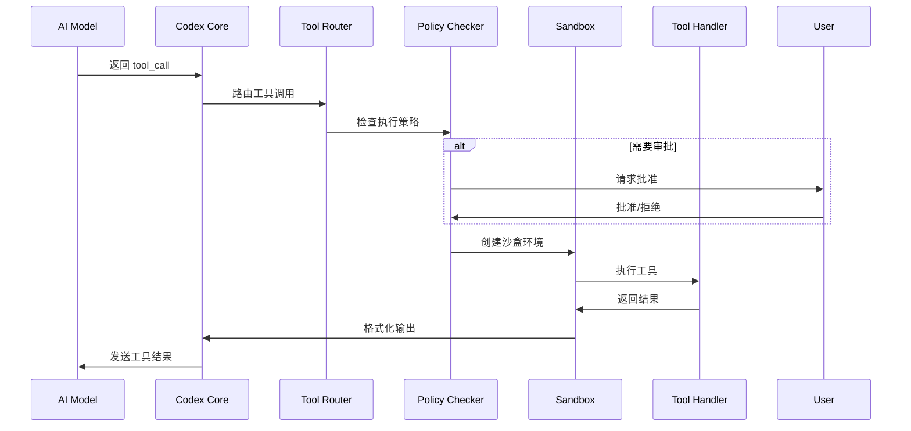

#### 3.2.3 内置工具一览

| 工具名 | 功能 | 沙盒级别 |
| --- | --- | --- |
| `bash` | 执行 Shell 命令 | workspace-write |
| `read` | 读取文件内容 | read-only |
| `write` | 写入文件 | workspace-write |
| `edit` | 编辑文件（diff） | workspace-write |
| `grep` | 搜索文件内容 | read-only |
| `glob` | 文件模式匹配 | read-only |
| `web_search` | 网络搜索 | 需网络权限 |
| `lsp` | LSP 代码智能 | read-only |

---

### 3.3 沙盒安全机制

#### 3.3.1 沙盒策略层级

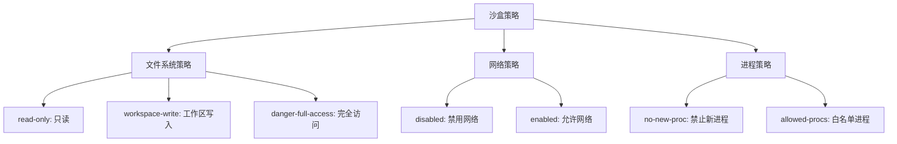

#### 3.3.2 Linux Landlock 实现

```rust
// 位置: codex-rs/linux-sandbox/src/landlock.rs

pub async fn spawn_command_under_linux_sandbox(
    command: Vec<String>,
    cwd: PathBuf,
    policy: &SandboxPolicy,
    network: Option<&NetworkProxy>,
) -> std::io::Result<Child> {
    // 1. 创建 Landlock 规则
    let rules = create_landlock_rules(&policy.file_system);

    // 2. 应用 seccomp 过滤
    let seccomp_filter = create_seccomp_filter(&policy.syscalls);

    // 3. 使用 bubblewrap 创建命名空间
    let mut cmd = Command::new("bwrap");
    cmd.args(&[
        "--ro-bind", "/usr", "/usr",
        "--ro-bind", "/lib", "/lib",
        "--ro-bind", "/lib64", "/lib64",
        "--bind", cwd.to_str().unwrap(), "/workspace",
        "--dev", "/dev",
        "--proc", "/proc",
        "--unshare-all",
    ]);

    // 4. 应用网络策略
    if policy.network.allowed {
        cmd.arg("--share-net");
    }

    // 5. 执行命令
    cmd.spawn()
}
```

**Landlock 规则示例**:

```rust
fn create_landlock_rules(fs_policy: &FileSystemSandboxPolicy) -> Vec<LandlockRule> {
    let mut rules = Vec::new();

    // 只读路径
    for path in &fs_policy.read {
        rules.push(LandlockRule {
            path: path.clone(),
            access: AccessFs::ReadFile | AccessFs::ReadDir,
        });
    }

    // 读写路径
    for path in &fs_policy.write {
        rules.push(LandlockRule {
            path: path.clone(),
            access: AccessFs::ReadWrite,
        });
    }

    rules
}
```

#### 3.3.3 平台特定实现对比

| 特性 | Linux | macOS | Windows |
| --- | --- | --- | --- |
| **文件隔离** | Landlock + bind mount | Seatbelt | Windows Sandbox |
| **进程隔离** | namespaces + seccomp | Seatbelt | Job Objects |
| **网络隔离** | network namespaces | Seatbelt | Windows Firewall |
| **用户隔离** | user namespaces | 可选 | Low Integrity |

---

### 3.4 MCP 协议集成

#### 3.4.1 MCP 架构

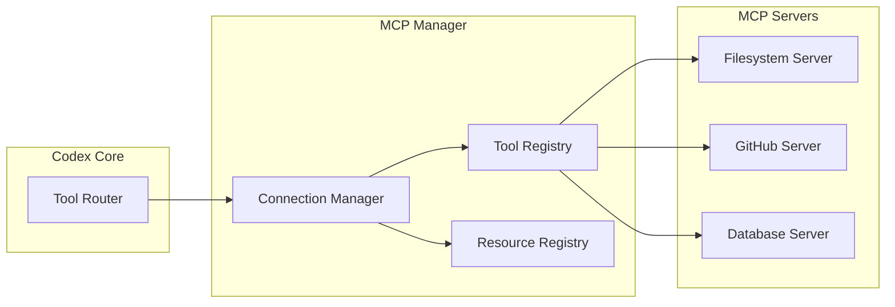

#### 3.4.2 MCP 连接管理

```rust
// 位置: codex-rs/core/src/mcp/

pub struct McpConnectionManager {
    // MCP 客户端连接
    clients: HashMap<String, RmcpClient>,
    // 工具注册表
    tools: HashMap<String, McpTool>,
    // 资源模板
    resource_templates: HashMap<String, ResourceTemplate>,
}

impl McpConnectionManager {
    // 初始化 MCP 服务器
    pub async fn initialize_server(
        &mut self,
        name: &str,
        config: &McpServerConfig,
    ) -> Result<(), McpStartupError> {
        // 1. 启动 MCP 服务器进程
        let client = self.start_mcp_process(config).await?;

        // 2. 发送初始化请求
        let init_result = client.initialize().await?;

        // 3. 获取工具列表
        let tools = client.list_tools().await?;
        for tool in tools {
            let full_name = format!("{}__{}", name, tool.name);
            self.tools.insert(full_name, tool);
        }

        // 4. 注册客户端
        self.clients.insert(name.to_string(), client);

        Ok(())
    }

    // 调用 MCP 工具
    pub async fn call_tool(
        &self,
        server_name: &str,
        tool_name: &str,
        arguments: Value,
    ) -> Result<CallToolResult, McpError> {
        let client = self.clients.get(server_name)
            .ok_or(McpError::ServerNotFound)?;

        client.call_tool(tool_name, arguments).await
    }
}
```

#### 3.4.3 MCP 工具调用流程

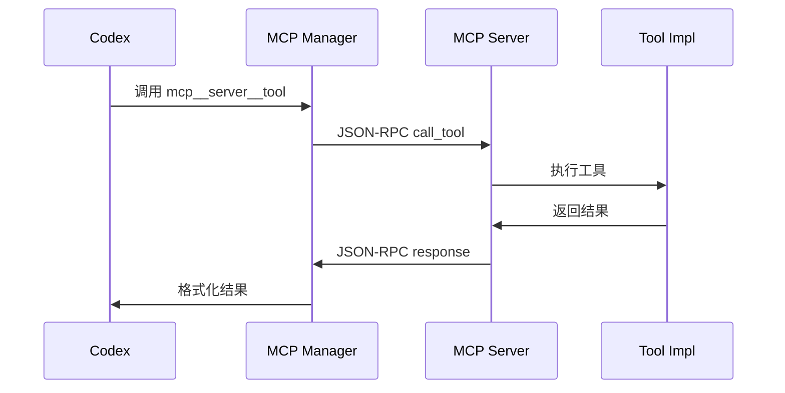

---

### 3.5 技能系统

#### 3.5.1 技能定义格式

```yaml
# 位置: ~/.codex/skills/my-skill/SKILL.md
---
name: code-review
description: 执行代码审查，检查代码质量、安全性和最佳实践
triggers:
  - /review
  - /cr
dependencies:
  mcp_servers:
    - github
  env_vars:
    - GITHUB_TOKEN
---

# Code Review Skill

## Objective
对代码变更进行全面审查，包括：
- 代码质量检查
- 安全漏洞扫描
- 性能问题识别
- 最佳实践建议

## Commands

### 审查当前分支
```bash
git diff main...HEAD
```

### 审查特定文件
```bash
git diff main -- path/to/file
```

## Workflow
1. 获取变更内容
2. 分析代码变更
3. 识别潜在问题
4. 生成审查报告
```

#### 3.5.2 技能加载机制

```rust
// 位置: codex-rs/core/src/skills/

pub struct SkillsManager {
    skills: HashMap<String, Skill>,
    skill_roots: Vec<PathBuf>,
}

impl SkillsManager {
    pub async fn load_skills(&mut self) -> Result<(), SkillError> {
        for root in &self.skill_roots {
            self.scan_skill_directory(root).await?;
        }
        Ok(())
    }

    async fn scan_skill_directory(&mut self, path: &Path) -> Result<(), SkillError> {
        for entry in fs::read_dir(path).await? {
            let entry = entry?;
            let skill_path = entry.path();

            if skill_path.join("SKILL.md").exists() {
                let skill = self.parse_skill(&skill_path).await?;
                self.skills.insert(skill.name.clone(), skill);
            }
        }
        Ok(())
    }
}
```

#### 3.5.3 技能注入到上下文

```rust
// 技能注入到系统提示
pub fn build_skill_injections(skills: &[Skill]) -> String {
    let mut injections = String::new();

    for skill in skills {
        injections.push_str(&format!(
            "## 技能: {}\n\n{}\n\n",
            skill.name,
            skill.content
        ));
    }

    injections
}
```

---

### 3.6 AI 模型客户端

#### 3.6.1 流式响应处理

```rust
// 位置: codex-rs/core/src/client.rs

pub struct ModelClientSession {
    client: Arc<ModelClient>,
    session_id: String,
}

impl ModelClientSession {
    pub async fn stream_completion(
        &self,
        messages: Vec<Message>,
        tools: Vec<Tool>,
    ) -> Result<impl Stream<Item = StreamEvent>, ModelError> {
        // 1. 构建请求
        let request = CompletionRequest {
            model: self.config.model.clone(),
            messages,
            tools: Some(tools),
            stream: true,
        };

        // 2. 建立 SSE 连接
        let response = self.client
            .post("/v1/chat/completions")
            .json(&request)
            .send()
            .await?;

        // 3. 解析 SSE 流
        let stream = response.bytes_stream()
            .map(|chunk| parse_sse_event(chunk));

        Ok(stream)
    }
}

// SSE 事件解析
fn parse_sse_event(data: &[u8]) -> Option<StreamEvent> {
    let text = std::str::from_utf8(data).ok()?;

    for line in text.lines() {
        if line.starts_with("data: ") {
            let json = &line[6..];
            if json == "[DONE]" {
                return Some(StreamEvent::Done);
            }
            let chunk: CompletionChunk = serde_json::from_str(json).ok()?;
            return Some(StreamEvent::Chunk(chunk));
        }
    }
    None
}
```

#### 3.6.2 多模型支持

```rust
// 位置: codex-rs/core/src/model_provider_info.rs

pub struct ModelProviderInfo {
    pub id: String,
    pub name: String,
    pub base_url: Url,
    pub auth_mode: AuthMode,
    pub default_model: String,
}

// 内置提供商
pub fn built_in_model_providers() -> HashMap<String, ModelProviderInfo> {
    let mut providers = HashMap::new();

    // OpenAI
    providers.insert("openai".to_string(), ModelProviderInfo {
        id: "openai".to_string(),
        name: "OpenAI".to_string(),
        base_url: "https://api.openai.com".parse().unwrap(),
        auth_mode: AuthMode::ApiKey,
        default_model: "gpt-4".to_string(),
    });

    // Ollama
    providers.insert("ollama".to_string(), ModelProviderInfo {
        id: "ollama".to_string(),
        name: "Ollama".to_string(),
        base_url: "http://localhost:11434".parse().unwrap(),
        auth_mode: AuthMode::None,
        default_model: "llama2".to_string(),
    });

    // LM Studio
    providers.insert("lmstudio".to_string(), ModelProviderInfo {
        id: "lmstudio".to_string(),
        name: "LM Studio".to_string(),
        base_url: "http://localhost:1234".parse().unwrap(),
        auth_mode: AuthMode::None,
        default_model: "local-model".to_string(),
    });

    providers
}
```

#### 3.6.3 上下文窗口管理

```rust
// 位置: codex-rs/core/src/compact.rs

pub struct ContextManager {
    max_tokens: usize,
    compression_threshold: f32,
}

impl ContextManager {
    // 压缩上下文
    pub async fn compact_context(
        &self,
        messages: &[Message],
    ) -> Result<Vec<Message>, CompactError> {
        let current_tokens = self.count_tokens(messages);

        if current_tokens < self.max_tokens as f32 * self.compression_threshold {
            return Ok(messages.to_vec());
        }

        // 1. 保留系统消息
        let system_messages: Vec<_> = messages.iter()
            .filter(|m| m.role == Role::System)
            .cloned()
            .collect();

        // 2. 压缩历史消息
        let history_messages: Vec<_> = messages.iter()
            .filter(|m| m.role != Role::System)
            .collect();

        let summary = self.summarize_messages(&history_messages).await?;

        // 3. 保留最近消息
        let recent_messages: Vec<_> = history_messages.iter()
            .rev()
            .take(10)
            .rev()
            .cloned()
            .collect();

        // 4. 组合新上下文
        let mut compacted = system_messages;
        compacted.push(Message {
            role: Role::System,
            content: format!("历史摘要:\n{}", summary),
        });
        compacted.extend(recent_messages);

        Ok(compacted)
    }
}
```

---

### 3.7 TUI 终端界面

#### 3.7.1 事件驱动架构

```rust
// 位置: codex-rs/tui/src/tui.rs

pub struct Tui {
    terminal: Terminal<CrosstermBackend<Stdout>>,
    event_broker: EventBroker,
}

// 事件类型
pub enum TuiEvent {
    Key(KeyEvent),
    Mouse(MouseEvent),
    Resize(u16, u16),
    Tick,
    AppEvent(AppEvent),
}

// 事件分发器
pub struct EventBroker {
    tx: broadcast::Sender<TuiEvent>,
}

impl EventBroker {
    pub fn spawn_event_loop(&self) -> JoinHandle<()> {
        let tx = self.tx.clone();

        tokio::spawn(async move {
            loop {
                // 键盘事件
                if let Ok(Event::Key(key)) = event::read() {
                    tx.send(TuiEvent::Key(key)).ok();
                }

                // 定时器
                tokio::time::sleep(Duration::from_millis(100)).await;
                tx.send(TuiEvent::Tick).ok();
            }
        })
    }
}
```

#### 3.7.2 组件层次结构

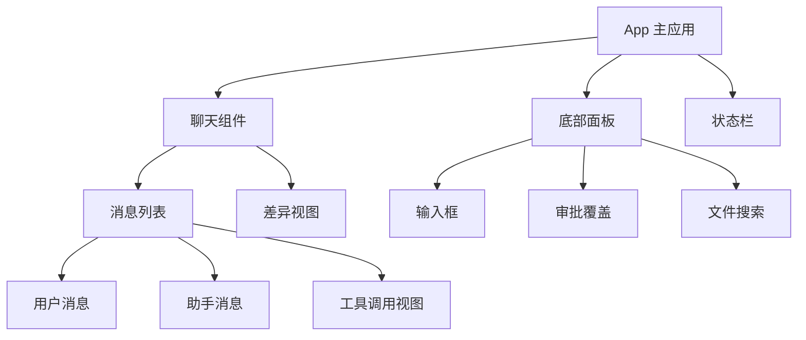

#### 3.7.3 状态管理

```rust
// 位置: codex-rs/tui/src/app.rs

pub struct AppState {
    // 会话状态
    pub thread_id: Option<ThreadId>,
    pub is_streaming: Arc<AtomicBool>,

    // UI 状态
    pub current_input: String,
    pub messages: Vec<Message>,
    pub scroll_offset: u16,

    // 审批状态
    pub pending_approval: Option<ApprovalRequest>,
}

impl AppState {
    // 处理事件
    pub fn handle_event(&mut self, event: TuiEvent) -> Option<AppAction> {
        match event {
            TuiEvent::Key(key) => self.handle_key(key),
            TuiEvent::Tick => self.on_tick(),
            TuiEvent::AppEvent(app) => self.handle_app_event(app),
            _ => None,
        }
    }
}
```

---

### 3.8 协议层设计

#### 3.8.1 消息类型定义

```rust
// 位置: codex-rs/protocol/src/protocol.rs

// 用户提交 (SQ - Submission Queue)
#[derive(Debug, Clone, Serialize, Deserialize)]
pub struct Submission {
    pub id: String,
    pub op: Op,
    pub trace: Option<W3cTraceContext>,
}

// 操作类型
#[derive(Debug, Clone, Serialize, Deserialize)]
pub enum Op {
    Submit {
        message: UserMessage,
    },
    Steer {
        input: Vec<UserInput>,
    },
    Stop,
    Fork {
        snapshot: ForkSnapshot,
    },
}

// 事件响应 (EQ - Event Queue)
#[derive(Debug, Clone, Serialize, Deserialize)]
pub struct EventMsg {
    pub thread_id: ThreadId,
    pub event: Event,
    pub timestamp: SystemTime,
}

// 事件类型
#[derive(Debug, Clone, Serialize, Deserialize)]
pub enum Event {
    ThreadStarted(ThreadStartedEvent),
    TurnStarted(TurnStartedEvent),
    TurnCompleted(TurnCompletedEvent),
    ItemStarted(ItemStartedEvent),
    ItemUpdated(ItemUpdatedEvent),
    ItemCompleted(ItemCompletedEvent),
    ToolCallStarted(ToolCallStartedEvent),
    ToolCallCompleted(ToolCallCompletedEvent),
    Error(ErrorEvent),
}
```

#### 3.8.2 SQ/EQ 通信模式

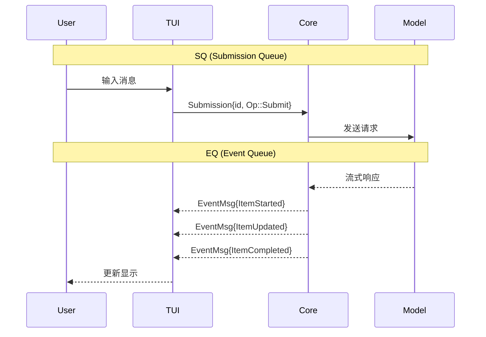

---

## 4. 技术原理深度分析

### 4.1 异步并发模型

#### 4.1.1 Tokio 运行时配置

```rust
// 位置: codex-rs/cli/src/main.rs

#[tokio::main]
async fn main() {
    // 配置 Tokio 运行时
    let rt = runtime::Builder::new_multi_thread()
        .worker_threads(4)
        .max_blocking_threads(16)
        .enable_all()
        .build()
        .unwrap();

    rt.block_on(async {
        // 启动应用
        run_app().await
    });
}
```

#### 4.1.2 并发原语使用

| 原语 | 用途 | 示例 |
| --- | --- | --- |
| `Arc<Mutex<T>>` | 共享可变状态 | ThreadManager 状态 |
| `Arc<RwLock<T>>` | 读多写少 | 配置管理 |
| `mpsc::channel` | 单生产者多消费者 | 命令执行 |
| `broadcast::channel` | 多生产者多消费者 | 事件分发 |
| `AtomicBool` | 无锁标志 | 流式状态 |
| `Semaphore` | 并发限制 | 工具执行池 |

#### 4.1.3 异步模式

```rust
// 模式1: Select 多路复用
tokio::select! {
    result = async_operation1() => {
        handle_result1(result);
    }
    result = async_operation2() => {
        handle_result2(result);
    }
    _ = cancellation_token.cancelled() => {
        cleanup();
    }
}

// 模式2: 超时控制
match tokio::time::timeout(Duration::from_secs(30), operation()).await {
    Ok(result) => handle(result),
    Err(_) => handle_timeout(),
}

// 模式3: 取消令牌
let token = CancellationToken::new();
let cloned = token.clone();

tokio::spawn(async move {
    loop {
        tokio::select! {
            _ = cloned.cancelled() => break,
            _ = do_work() => {}
        }
    }
});

// 取消所有任务
token.cancel();
```

---

### 4.2 流式处理原理

#### 4.2.1 SSE (Server-Sent Events)

```rust
// SSE 响应解析
pub struct SseStream {
    buffer: Vec<u8>,
}

impl SseStream {
    pub fn parse(&mut self, chunk: &[u8]) -> Vec<SseEvent> {
        self.buffer.extend_from_slice(chunk);
        let mut events = Vec::new();

        while let Some(pos) = self.buffer.windows(4).position(|w| w == b"\n\n\n\n") {
            let data: Vec<u8> = self.buffer.drain(..pos).collect();
            self.buffer.drain(..4); // 移除分隔符

            if let Ok(text) = std::str::from_utf8(&data) {
                if let Some(event) = self.parse_event(text) {
                    events.push(event);
                }
            }
        }

        events
    }

    fn parse_event(&self, text: &str) -> Option<SseEvent> {
        let mut event_type = None;
        let mut data = String::new();

        for line in text.lines() {
            if line.starts_with("event:") {
                event_type = Some(line[6..].trim().to_string());
            } else if line.starts_with("data:") {
                data.push_str(&line[5..].trim());
                data.push('\n');
            }
        }

        Some(SseEvent {
            event: event_type?,
            data,
        })
    }
}
```

#### 4.2.2 背压控制

```rust
// 背压感知的流处理
pub struct BackpressureStream<T> {
    inner: Pin<Box<dyn Stream<Item = T>>>,
    buffer: VecDeque<T>,
    max_buffer: usize,
}

impl<T> Stream for BackpressureStream<T> {
    type Item = T;

    fn poll_next(mut self: Pin<&mut Self>, cx: &mut Context<'_>) -> Poll<Option<T>> {
        // 如果缓冲区满，暂停拉取
        if self.buffer.len() >= self.max_buffer {
            return Poll::Pending;
        }

        // 从内部流拉取
        match self.inner.as_mut().poll_next(cx) {
            Poll::Ready(Some(item)) => {
                self.buffer.push_back(item);
                Poll::Ready(self.buffer.pop_front())
            }
            Poll::Ready(None) => Poll::Ready(None),
            Poll::Pending => Poll::Pending,
        }
    }
}
```

---

### 4.3 安全隔离原理

#### 4.3.1 Linux Namespace 隔离

```rust
// 使用 unshare 创建隔离环境
fn create_isolated_process() -> Result<Child, Error> {
    // 创建新的命名空间
    let mut cmd = Command::new("unshare");

    cmd.args(&[
        "--user",           // 用户命名空间
        "--pid",            // PID 命名空间
        "--net",            // 网络命名空间
        "--mount",          // 挂载命名空间
        "--fork",           // fork 子进程
        "--map-root-user",  // 映射为 root
    ]);

    cmd.spawn()
}
```

#### 4.3.2 Seccomp 系统调用过滤

```rust
// 定义允许的系统调用
const ALLOWED_SYSCALLS: &[&str] = &[
    "read", "write", "open", "close",
    "stat", "fstat", "lstat",
    "mmap", "munmap", "brk",
    "exit", "exit_group",
];

fn apply_seccomp_filter() -> Result<(), Error> {
    // 使用 libseccomp 创建过滤器
    let mut filter = ScmpFilterContext::new(ScmpAction::Errno(1))?;

    for syscall in ALLOWED_SYSCALLS {
        let syscall_id = Seccomp::get_syscall_from_name(syscall, None)?;
        filter.add_rule(ScmpAction::Allow, syscall_id)?;
    }

    filter.load()?;
    Ok(())
}
```

---

### 4.4 类型系统设计

#### 4.4.1 Newtype 模式

```rust
// 强类型 ID
#[derive(Debug, Clone, PartialEq, Eq, Hash)]
pub struct ThreadId(String);

impl ThreadId {
    pub fn new() -> Self {
        Self(uuid::Uuid::new_v4().to_string())
    }

    pub fn as_str(&self) -> &str {
        &self.0
    }
}

// 防止混淆不同类型的 ID
#[derive(Debug, Clone, PartialEq, Eq, Hash)]
pub struct ConnectionId(String);

#[derive(Debug, Clone, PartialEq, Eq, Hash)]
pub struct ToolCallId(String);
```

#### 4.4.2 类型状态模式

```rust
// 编译时状态检查
pub struct Thread<State>(PhantomData<State>);

pub struct Created;
pub struct Ready;
pub struct Running;

impl Thread<Created> {
    pub fn initialize(self) -> Thread<Ready> {
        // 初始化逻辑
        Thread(PhantomData)
    }
}

impl Thread<Ready> {
    pub fn start(self) -> Thread<Running> {
        // 启动逻辑
        Thread(PhantomData)
    }
}

impl Thread<Running> {
    pub fn submit(&self, op: Op) -> Result<(), Error> {
        // 执行操作
        Ok(())
    }
}

// 编译时保证状态转换正确
// let thread: Thread<Created> = Thread::new();
// thread.submit(op);  // 编译错误！Created 状态不能 submit
```

---

## 5. 数据流与时序图

### 5.1 完整请求处理流程

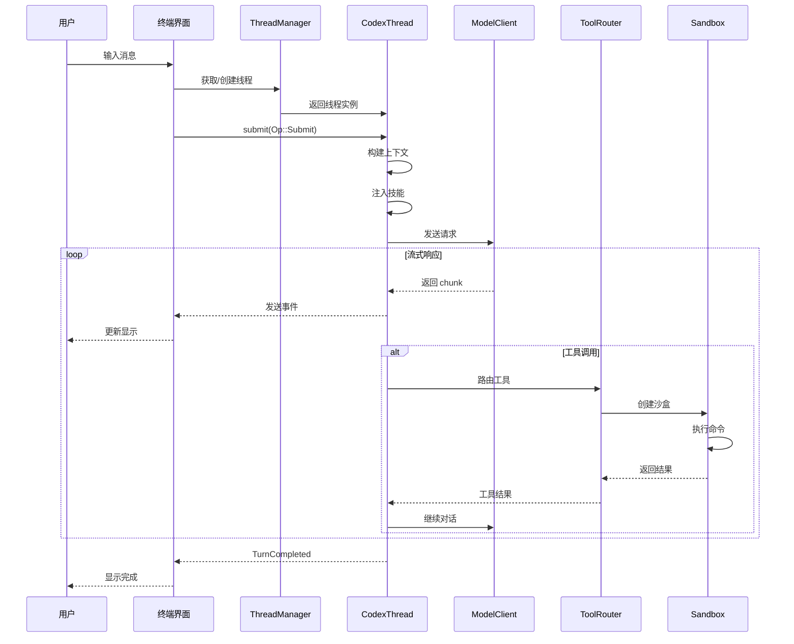

### 5.2 工具调用详细时序

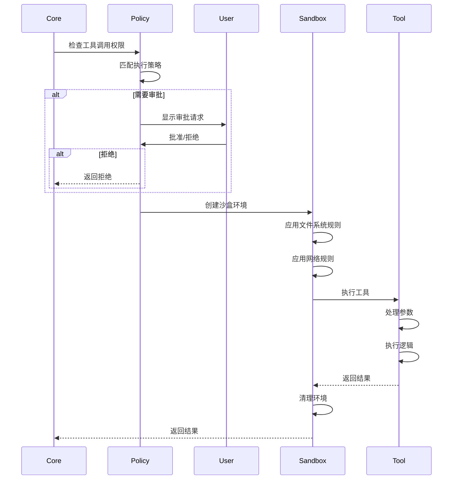

### 5.3 会话持久化流程

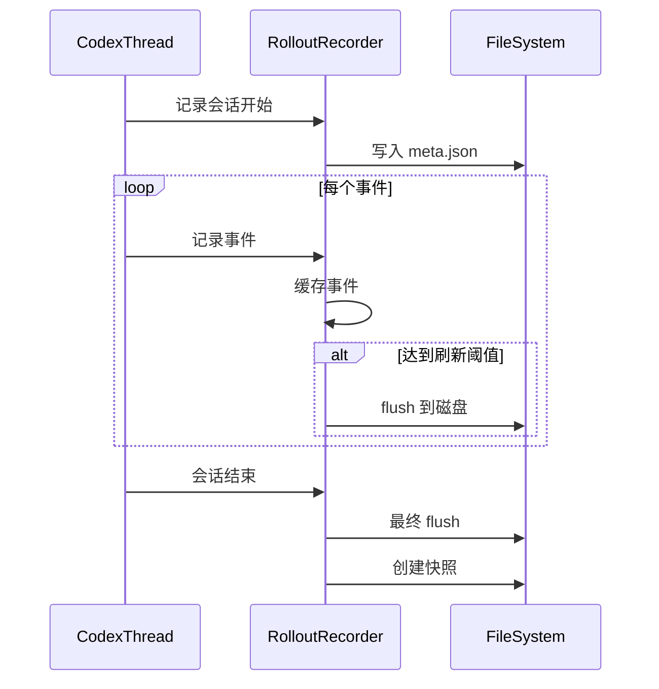

---

## 6. AI CLI 通用设计模式

### 6.1 架构模式对比

| 模式 | Codex | Aider | Claude Code |
| --- | --- | --- | --- |
| **核心语言** | Rust | Python | TypeScript |
| **CLI 框架** | clap | argparse | oclif |
| **TUI 框架** | ratatui | rich | ink |
| **异步运行时** | Tokio | asyncio | Node.js |
| **沙盒技术** | Landlock | 无 | Seatbelt |
| **工具协议** | MCP | 内置 | MCP |

### 6.2 通用核心模块

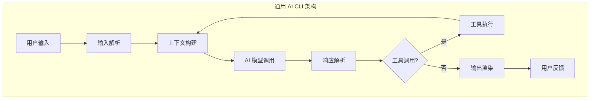

### 6.3 设计模式应用

#### 6.3.1 策略模式 - 沙盒策略

```rust
// 沙盒策略接口
pub trait SandboxStrategy: Send + Sync {
    fn create_environment(&self, policy: &SandboxPolicy) -> Result<Sandbox, Error>;
    fn execute(&self, sandbox: &Sandbox, command: &Command) -> Result<Output, Error>;
}

// Linux 实现
pub struct LinuxSandboxStrategy;

impl SandboxStrategy for LinuxSandboxStrategy {
    fn create_environment(&self, policy: &SandboxPolicy) -> Result<Sandbox, Error> {
        // Landlock + namespace 实现
    }
}

// macOS 实现
pub struct MacOsSandboxStrategy;

impl SandboxStrategy for MacOsSandboxStrategy {
    fn create_environment(&self, policy: &SandboxPolicy) -> Result<Sandbox, Error> {
        // Seatbelt 实现
    }
}

// 策略工厂
pub fn get_sandbox_strategy() -> Box<dyn SandboxStrategy> {
    #[cfg(target_os = "linux")]
    { Box::new(LinuxSandboxStrategy) }

    #[cfg(target_os = "macos")]
    { Box::new(MacOsSandboxStrategy) }

    #[cfg(target_os = "windows")]
    { Box::new(WindowsSandboxStrategy) }
}
```

#### 6.3.2 观察者模式 - 事件系统

```rust
// 事件观察者
pub trait EventObserver: Send + Sync {
    fn on_event(&self, event: &Event);
}

// 事件发布者
pub struct EventPublisher {
    observers: Vec<Arc<dyn EventObserver>>,
}

impl EventPublisher {
    pub fn subscribe(&mut self, observer: Arc<dyn EventObserver>) {
        self.observers.push(observer);
    }

    pub fn publish(&self, event: Event) {
        for observer in &self.observers {
            observer.on_event(&event);
        }
    }
}

// 具体观察者
pub struct LoggingObserver;

impl EventObserver for LoggingObserver {
    fn on_event(&self, event: &Event) {
        tracing::info!("Event: {:?}", event);
    }
}

pub struct TelemetryObserver;

impl EventObserver for TelemetryObserver {
    fn on_event(&self, event: &Event) {
        // 发送遥测数据
    }
}
```

#### 6.3.3 工厂模式 - 工具创建

```rust
// 工具工厂
pub struct ToolFactory {
    handlers: HashMap<String, Box<dyn ToolHandler>>,
}

impl ToolFactory {
    pub fn register(&mut self, name: &str, handler: Box<dyn ToolHandler>) {
        self.handlers.insert(name.to_string(), handler);
    }

    pub fn create(&self, name: &str) -> Option<&dyn ToolHandler> {
        self.handlers.get(name).map(|b| b.as_ref())
    }
}

// 使用
let mut factory = ToolFactory::new();
factory.register("bash", Box::new(BashHandler));
factory.register("read", Box::new(ReadHandler));
factory.register("write", Box::new(WriteHandler));
```

---

## 7. 实战使用指南

### 7.1 基本使用

#### 7.1.1 启动交互式会话

```bash
# 启动默认会话
codex

# 指定模型
codex --model gpt-4

# 指定工作目录
codex --cd /path/to/project

# 配置沙盒模式
codex --sandbox workspace-write

# 添加额外目录
codex --add-dir /path/to/extra
```

#### 7.1.2 非交互式执行

```bash
# 执行单次任务
codex exec "创建一个 React 组件"

# 使用管道
cat error.log | codex exec "分析错误并给出修复建议"

# 指定输出格式
codex exec --json "检查代码质量"
```

#### 7.1.3 会话管理

```bash
# 恢复上次会话
codex resume --last

# 恢复特定会话
codex resume abc123

# 分支会话
codex fork abc123

# 列出所有会话
codex cloud tasks list
```

### 7.2 配置管理

#### 7.2.1 配置文件

```toml
# ~/.codex/config.toml

# 模型配置
model = "gpt-4"
model_reasoning_effort = "high"

# 沙盒配置
approval_policy = "on-request"

[sandbox_workspace_write]
network_access = true

# Web 搜索
web_search = "live"

# MCP 服务器
[mcp_servers.github]
command = "mcp-server-github"
args = ["--read-only"]

[mcp_servers.filesystem]
command = "mcp-server-filesystem"
args = ["/home/user/projects"]

# 技能配置
[skills]
enabled = ["code-review", "test-gen"]
```

#### 7.2.2 环境变量

```bash
# API 密钥
export CODEX_API_KEY="sk-..."

# 自定义 API 端点
export OPENAI_BASE_URL="https://api.custom.com"

# 调试日志
export RUST_LOG=codex=debug

# 禁用遥测
export CODEX_DISABLE_TELEMETRY=1
```

### 7.3 技能开发

#### 7.3.1 创建技能

```markdown
<!-- ~/.codex/skills/code-review/SKILL.md -->
---
name: code-review
description: 代码审查技能
---

# Code Review Skill

## Objective
执行全面的代码审查

## Commands

### 审查当前变更
```bash
git diff HEAD~1
```

### 审查特定文件
```bash
git diff main -- <file>
```

## Workflow
1. 获取变更内容
2. 分析代码质量
3. 检查安全问题
4. 生成审查报告

## Output Format
- 严重问题: 🔴
- 警告: 🟡
- 建议: 🟢
```

#### 7.3.2 使用技能

```bash
# 通过斜杠命令
codex /code-review

# 通过提示词
codex "使用 code-review 技能审查最近的变更"
```

### 7.4 MCP 集成

#### 7.4.1 添加 MCP 服务器

```bash
# 添加 GitHub MCP
codex mcp add github mcp-server-github

# 添加文件系统 MCP
codex mcp add filesystem mcp-server-filesystem /path/to/dir

# 列出所有 MCP
codex mcp list

# 移除 MCP
codex mcp remove github
```

#### 7.4.2 配置 MCP

```toml
# ~/.codex/config.toml

[mcp_servers.github]
command = "mcp-server-github"
env = { GITHUB_TOKEN = "${GITHUB_TOKEN}" }

[mcp_servers.database]
command = "mcp-server-postgres"
args = ["postgresql://localhost/mydb"]
```

### 7.5 TypeScript SDK

```typescript
import { Codex } from "@openai/codex";

// 创建实例
const codex = new Codex({
  apiKey: process.env.CODEX_API_KEY,
});

// 启动线程
const thread = codex.startThread({
  model: "gpt-4",
  sandboxMode: "workspace-write",
});

// 流式执行
const stream = await thread.runStreamed("创建一个函数");

for await (const event of stream.events) {
  switch (event.type) {
    case "thread.started":
      console.log("Thread ID:", event.thread_id);
      break;
    case "item.started":
      console.log("开始处理:", event.item);
      break;
    case "item.completed":
      if (event.item.type === "agent_message") {
        console.log("响应:", event.item.text);
      }
      break;
    case "turn.completed":
      console.log("Token 使用:", event.usage);
      break;
  }
}

// 同步执行
const result = await thread.run("创建一个函数");
console.log(result.finalResponse);
```

---

## 8. 扩展开发指南

### 8.1 开发环境搭建

```bash
# 克隆仓库
git clone https://github.com/openai/codex.git
cd codex

# 安装 Rust
curl --proto '=https' --tlsv1.2 -sSf https://sh.rustup.rs | sh

# 安装 Node.js (用于 TypeScript SDK)
npm install

# 构建
cargo build

# 运行测试
cargo test

# 运行
cargo run --package codex-cli
```

### 8.2 添加新工具

```rust
// 位置: codex-rs/core/src/tools/my_tool.rs

use async_trait::async_trait;
use crate::tools::{ToolHandler, ToolInvocation, ToolOutput};

pub struct MyToolHandler;

#[async_trait]
impl ToolHandler for MyToolHandler {
    type Output = MyToolOutput;

    fn kind(&self) -> ToolKind {
        ToolKind::Function
    }

    fn name(&self) -> &str {
        "my_tool"
    }

    fn description(&self) -> &str {
        "我的自定义工具"
    }

    fn parameters(&self) -> &JsonSchema {
        // JSON Schema 定义参数
    }

    async fn handle(
        &self,
        invocation: ToolInvocation
    ) -> Result<Self::Output, FunctionCallError> {
        // 实现工具逻辑
        let args: MyToolArgs = serde_json::from_value(invocation.arguments)?;

        // 执行操作
        let result = do_something(args).await?;

        Ok(MyToolOutput { result })
    }
}

// 注册工具
// 位置: codex-rs/core/src/tools/mod.rs
pub fn register_builtin_tools(registry: &mut ToolRegistry) {
    registry.register("my_tool", Box::new(MyToolHandler));
}
```

### 8.3 添加新 MCP 服务器

```bash
# 1. 创建 MCP 服务器项目
mkdir my-mcp-server
cd my-mcp-server
npm init -y

# 2. 安装 MCP SDK
npm install @modelcontextprotocol/sdk

# 3. 实现服务器
```

```typescript
// my-mcp-server/src/index.ts
import { Server } from "@modelcontextprotocol/sdk/server";
import { StdioServerTransport } from "@modelcontextprotocol/sdk/server/stdio";

const server = new Server({
  name: "my-mcp-server",
  version: "1.0.0",
}, {
  capabilities: {
    tools: {},
  },
});

// 注册工具
server.setRequestHandler(ListToolsRequestSchema, async () => {
  return {
    tools: [
      {
        name: "my_tool",
        description: "我的工具",
        inputSchema: {
          type: "object",
          properties: {
            input: { type: "string" },
          },
        },
      },
    ],
  };
});

// 处理工具调用
server.setRequestHandler(CallToolRequestSchema, async (request) => {
  if (request.params.name === "my_tool") {
    const result = await doSomething(request.params.arguments);
    return { content: [{ type: "text", text: result }] };
  }
  throw new Error("Unknown tool");
});

// 启动服务器
const transport = new StdioServerTransport();
server.connect(transport);
```

### 8.4 贡献代码

```bash
# 1. Fork 仓库

# 2. 创建分支
git checkout -b feature/my-feature

# 3. 编写代码

# 4. 运行测试
cargo test
cargo clippy
cargo fmt --check

# 5. 提交
git commit -m "feat: add my feature"

# 6. 推送并创建 PR
git push origin feature/my-feature
```

---

## 附录

### A. 命令行参数参考

```bash
codex [OPTIONS] [PROMPT]

选项:
  -m, --model <MODEL>           模型选择
  -s, --sandbox <SANDBOX>       沙盒模式
  --cd <DIR>                    工作目录
  --add-dir <DIR>               添加目录
  --config <KEY=VALUE>          配置覆盖
  --skip-git-repo-check         跳过 Git 检查
  --debug                       调试模式

子命令:
  exec                          非交互式执行
  resume                        恢复会话
  fork                          分支会话
  review                        代码审查
  login                         登录
  logout                        登出
  mcp                           MCP 管理
  mcp-server                    作为 MCP 服务器
  completion                    Shell 补全
```

### B. 配置选项参考

| 配置项 | 类型 | 默认值 | 描述 |
| --- | --- | --- | --- |
| `model` | string | "gpt-4" | 默认模型 |
| `approval_policy` | string | "on-request" | 审批策略 |
| `sandbox_policy` | string | "workspace-write" | 沙盒策略 |
| `web_search` | string | "disabled" | 网络搜索 |
| `model_reasoning_effort` | string | "medium" | 推理强度 |

### C. 环境变量参考

| 变量 | 描述 |
| --- | --- |
| `CODEX_API_KEY` | API 密钥 |
| `OPENAI_BASE_URL` | API 端点 |
| `RUST_LOG` | 日志级别 |
| `CODEX_DISABLE_TELEMETRY` | 禁用遥测 |

### D. 相关资源

- **GitHub 仓库**: https://github.com/openai/codex
- **MCP 协议**: https://modelcontextprotocol.io
- **Tokio 文档**: https://tokio.rs
- **Ratatui 文档**: https://docs.rs/ratatui
